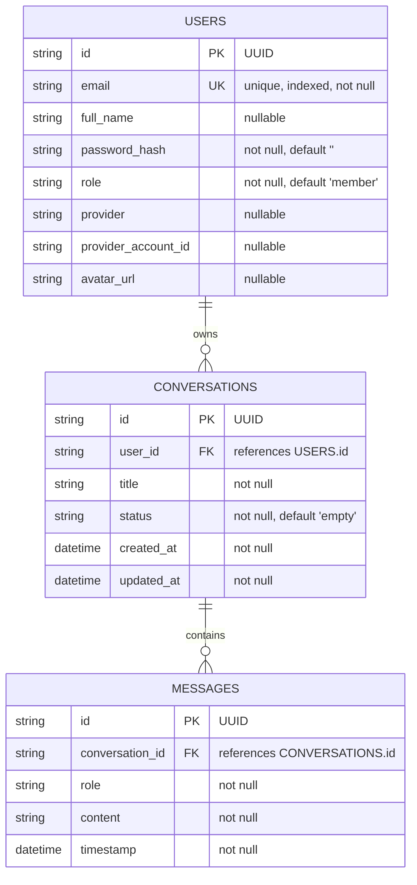

# Privia ERD

## Constraints

- `USERS.email` is unique (`ix_users_email`).
- `MESSAGES.conversation_id -> CONVERSATIONS.id` has `ON DELETE CASCADE`.
- SQLite foreign keys are enforced via `PRAGMA foreign_keys=ON`.
- Partial unique index on conversations: `ix_conversations_one_empty_per_user` enforces at most one `"empty"` conversation per user.
